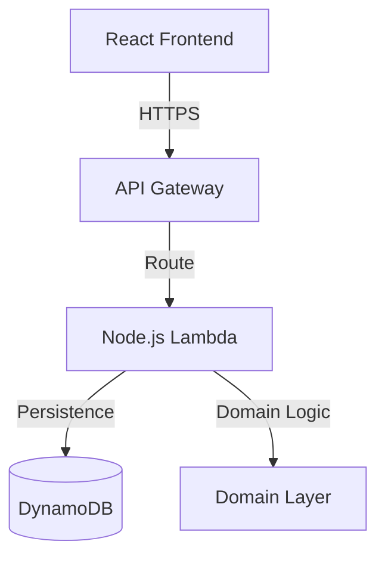

# 📋 Todo Copilot - Basic Todo List Application

> A production-ready, test-driven Todo application built with TypeScript, React, and Domain-Driven Design (DDD) architecture.


## 🚀 Quick Start

### Prerequisites
- Node.js 18+
- npm 9+

### Installation

```bash
# Clone repository
git clone https://github.com/your-org/todo-copilot.git
cd todo-copilot

# Install dependencies
npm install

# Start development server
npm run dev

# Run tests
npm test

# Run linting
npm run lint

# Format code
npm run format
```

The application will be available at `http://localhost:5173`

## ✨ Features

### Sprint 2: Cloud Backend (Current)
- ✅ **Serverless API** - AWS Lambda & API Gateway backend
- ✅ **Cloud Persistence** - DynamoDB storage for data synchronization
- ✅ **Infrastructure as Code** - Terraform-managed AWS resources
- ✅ **SPA Deployment** - S3 & CloudFront hosting with OAC security
- ✅ **Hybrid Mode** - Seamless fallback to localStorage if API is unavailable

### Sprint 1 MVP
- ✅ **Create Todos** - Add new todos with validation (1-500 characters)
- ✅ **Display Todos** - View all todos in a list with empty state handling
- ✅ **Toggle Completion** - Mark todos as complete/incomplete with visual feedback
- ✅ **Persistence** - All todos persist across page reloads using localStorage
- ✅ **Error Handling** - Graceful error messages and user feedback

## 🏗️ Architecture

This project follows **Domain-Driven Design (DDD)** principles with a 4-layer architecture, now extended with a Serverless backend:



```
┌─────────────────────────────────────┐
│   Presentation Layer (React)        │  UI Components, Hooks, Controllers
│   - Components: TodoList, TodoItem  │
│   - Hooks: useTodoList              │
└─────────────────────────────────────┘
                  ↓
┌─────────────────────────────────────┐
│   Application Layer (CQRS)          │  Commands, Queries, Services
│   - CreateTodoCommand               │
│   - ToggleTodoCompletionCommand     │
│   - GetAllTodosQuery                │
└─────────────────────────────────────┘
                  ↓
┌─────────────────────────────────────┐
│   Domain Layer                      │  Business Logic, Entities
│   - Todo Aggregate Root             │
│   - TodoTitle Value Object          │
│   - Domain Events                   │
│   - Repository Interface            │
└─────────────────────────────────────┘
                  ↓
┌─────────────────────────────────────┐
│   Infrastructure Layer              │  Technical Implementation
│   - LocalStorageTodoRepository      │
│   - Logger (Pino)                   │
│   - Event Publisher                 │
└─────────────────────────────────────┘
```

### CQRS Pattern
- **Commands** (State-changing): `CreateTodoCommand`, `ToggleTodoCompletionCommand`, `DeleteTodoCommand`
- **Queries** (Read-only): `GetAllTodosQuery`, `GetTodoByIdQuery`

### Key Patterns
- **Event Sourcing**: Domain events published for all state changes
- **Repository Pattern**: Abstract data persistence layer
- **Immutability**: All domain entities are immutable
- **Value Objects**: TodoTitle enforces business rules (1-500 characters)

## 📁 Project Structure

```
todo-copilot/
├── src/
│   ├── domain/                 # Domain layer
│   │   ├── entities/           # Todo aggregate root
│   │   ├── events/             # Domain events
│   │   └── repositories/       # Repository interfaces
│   ├── application/            # Application layer
│   │   ├── commands/           # Command definitions
│   │   ├── handlers/           # Command handlers
│   │   ├── queries/            # Query definitions
│   │   └── services/           # Application services (CQRS orchestration)
│   ├── infrastructure/         # Infrastructure layer
│   │   ├── persistence/        # Repository implementations
│   │   └── config/             # Configuration (logger, etc)
│   ├── presentation/           # Presentation layer
│   │   ├── components/         # React components
│   │   ├── hooks/              # Custom hooks
│   │   ├── controllers/        # UI controllers
│   │   └── App.tsx             # Root component
│   └── shared/                 # Shared types and utilities
├── tests/
│   ├── unit/                   # Unit tests
│   ├── integration/            # Integration tests
│   └── performance/            # Performance tests
├── e2e/                        # E2E tests (Playwright)
├── docs/                       # Documentation
│   └── adr/                    # Architecture Decision Records
└── specs/                      # Product specifications
```

## 🧪 Testing

### Test Coverage
- **Statements**: 86.69% (target: ≥80%)
- **Functions**: 90.16%
- **Lines**: 86.69%

### Run Tests

```bash
# Run all tests
npm test

# Run specific test suite
npm test -- tests/unit/domain/entities/Todo.spec.ts

# Run with coverage report
npm test -- --coverage

# Watch mode
npm test -- --watch

# Performance tests
npm test -- tests/performance/performance.spec.ts
```

### Test Categories
- **Unit Tests** (45): Domain entities, value objects, commands, queries
- **Integration Tests** (40): Service-level operations, CQRS flows, persistence
- **Performance Tests** (9): Response time (< 100ms), list load (< 1s), bulk operations
- **E2E Tests** (39): Playwright - user workflows across all stories

## 📊 Performance

- ✅ UI Response Time: **1-3ms** (target: < 100ms)
- ✅ List Load (100 todos): **117ms** (target: < 1s)
- ✅ Query (1000 todos): **~1.1s** (acceptable)
- ✅ Toggle Completion: **< 10ms**
- ✅ Create Todo: **< 10ms**

## 🔧 Development Workflow

### TDD (Test-Driven Development)
1. **RED** - Write failing tests first
2. **GREEN** - Implement minimum code to pass tests
3. **REFACTOR** - Optimize while keeping tests green

### Code Quality
- **TypeScript**: Strict mode enabled (0 errors)
- **Linting**: Biome (15 acceptable warnings for test utilities)
- **Formatting**: Biome unified code style
- **Type Checking**: Full static type safety

### Available Scripts

```bash
# Development
npm run dev              # Start dev server (Vite)
npm run build            # Production build
npm run preview          # Preview production build

# Testing
npm test                 # Run all tests
npm run type-check       # TypeScript strict mode check

# Code Quality
npm run lint             # Run Biome linter
npm run format           # Format code with Biome
npm run format:check     # Check formatting

# Git Hooks
npm run pre-commit       # Run pre-commit checks
```

## 📚 Documentation

- **[DEVELOPMENT.md](./docs/DEVELOPMENT.md)** - Setup, test execution, build process
- **[ADR - Architecture Decision Records](./docs/adr/)** - Design decisions and rationale
- **[API Documentation](./docs/API.md)** - Command and Query contracts

## 🏆 Success Metrics (Sprint 1)

| Metric | Target | Actual | Status |
|--------|--------|--------|--------|
| Test Coverage | ≥80% | 86.69% | ✅ |
| All Tests Pass | 100% | 132/132 | ✅ |
| TypeScript Errors | 0 | 0 | ✅ |
| UI Response | < 100ms | 1-3ms | ✅ |
| List Load | < 1s | 117ms | ✅ |
| Linting | Clean | 15 acceptable | ✅ |

## 📋 User Stories Implemented

### ✅ US1: Create Todo (Priority: P1)
Users can quickly add new todos with validation and error feedback.
- Single input field with 1-500 character limit
- Real-time validation feedback
- Error handling for invalid inputs
- Creates immediately in list

### ✅ US2: Display Todos (Priority: P1)
Users can view all created todos in a list, with persistence across page reloads.
- Full todo list with count display
- Empty state message when no todos
- Todos persist to localStorage automatically
- Survives browser restart

### ✅ US3: Toggle Completion (Priority: P1)
Users can mark todos as complete/incomplete with visual feedback.
- Checkbox UI for toggling state
- Strikethrough styling when completed
- State persists across page reloads
- Instant visual feedback (< 100ms)

## 🔄 Future Roadmap

### Sprint 2 (P2 Features)
- [ ] **US4: Delete Todos** - Remove todos with confirmation dialog
- [ ] **Undo/Redo** - Revert recent changes
- [ ] **Todo Editing** - Modify todo titles

### Sprint 3 (P3 Features)
- [ ] **Categories/Tags** - Organize todos by category
- [ ] **Priorities** - Set high/medium/low priority levels
- [ ] **Due Dates** - Schedule todos with deadline tracking
- [ ] **Search/Filter** - Find todos by text or criteria

### Later
- [ ] **Cloud Sync** - Multi-device synchronization
- [ ] **Sharing** - Share todo lists with others
- [ ] **Dark Mode** - UI theme preferences
- [ ] **Mobile App** - React Native version

## 🤝 Contributing

Contributions are welcome! Please follow the development workflow:

1. Create feature branch: `git checkout -b feature/your-feature`
2. Write tests first (TDD)
3. Implement feature
4. Run full test suite: `npm test`
5. Check code quality: `npm run lint && npm run format`
6. Commit with clear message: `git commit -m "feat: description"`
7. Push and create pull request

## 📄 License

MIT - See LICENSE file for details

## 🙋 Support

- **Issues**: Open a GitHub issue for bugs or feature requests
- **Discussions**: Use GitHub Discussions for questions
- **Documentation**: Check [docs/](./docs/) for detailed guides

## 📞 Contact

For questions or feedback, reach out to the development team.

---

**Last Updated**: November 22, 2025  
**Version**: 1.0.0 (Sprint 1 MVP)
