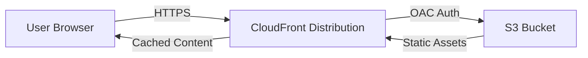

# SPA Deployment Architecture

This document describes the architecture and deployment process for the Single Page Application (SPA) frontend of Todo Copilot.

## Architecture

The frontend is hosted on AWS using a serverless architecture:

- **Amazon S3**: Stores the static assets (HTML, CSS, JS, images). The bucket is configured to block all public access.
- **Amazon CloudFront**: Acts as the Content Delivery Network (CDN) and entry point for users. It caches content at edge locations for low latency.
- **Origin Access Control (OAC)**: Secures the connection between CloudFront and S3. Only CloudFront is allowed to read objects from the S3 bucket.

### Diagram



## Deployment Process

The deployment is automated via GitHub Actions (`.github/workflows/terraform-ci.yml`).

1.  **Infrastructure Provisioning**: Terraform creates/updates the S3 bucket and CloudFront distribution.
2.  **Build**: The frontend application is built using Vite (`npm run build`). The API Gateway URL is injected via the `VITE_API_URL` environment variable.
3.  **Sync**: The build artifacts (`dist/` folder) are synced to the S3 bucket.
4.  **Invalidation**: The CloudFront cache is invalidated to ensure users see the latest version immediately.

## Manual Deployment (Dev)

If you need to deploy manually from your local machine (ensure you have AWS credentials configured):

```bash
# 1. Build the application
export VITE_API_URL=$(terraform -chdir=infrastructure/terraform output -raw api_gateway_endpoint)
npm run build

# 2. Sync to S3
export BUCKET_NAME=$(terraform -chdir=infrastructure/terraform output -raw frontend_bucket_name)
aws s3 sync dist/ s3://$BUCKET_NAME --delete

# 3. Invalidate Cache
export DIST_ID=$(terraform -chdir=infrastructure/terraform output -raw cloudfront_distribution_id)
aws cloudfront create-invalidation --distribution-id $DIST_ID --paths "/*"
```

## Access

The application is accessible at the CloudFront domain name (output as `cloudfront_domain_name` from Terraform).
