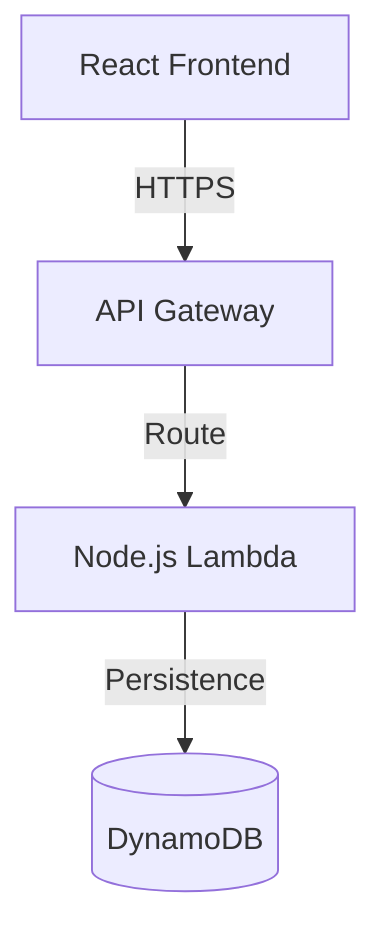

# ADR-004: Serverless Lambda Backend Architecture

## Status
✅ **ACCEPTED** - Implemented and validated in production

## Context
The initial version of the Todo application used `localStorage` for data persistence, which limited the application to a single device and browser. To enable data synchronization across devices and provide a robust backend, we needed to migrate to a cloud-based solution.

## Decision
We chose a **Serverless Architecture** on AWS using:
- **AWS Lambda** for compute (Node.js runtime)
- **Amazon API Gateway (HTTP API)** for routing and ingress
- **Amazon DynamoDB** for NoSQL data persistence
- **Terraform** for Infrastructure as Code (IaC)

## Rationale

### Why Serverless?
- **Cost Efficiency**: Pay only for execution time (scale-to-zero).
- **Scalability**: Automatic scaling to handle traffic spikes.
- **Operational Overhead**: No servers to manage or patch.

### Why DynamoDB?
- **Performance**: Single-digit millisecond latency at any scale.
- **Serverless**: No capacity planning required (On-Demand mode).
- **Integration**: Seamless integration with AWS Lambda.

### Why API Gateway (HTTP API)?
- **Cost**: Lower cost compared to REST APIs.
- **Performance**: Lower latency.
- **Simplicity**: Native CORS support and easy integration with Lambda.

## Architecture

### Component Diagram

### Data Flow
1. **Request**: Client sends HTTP request (GET/POST/PUT/DELETE) to API Gateway.
2. **Routing**: API Gateway routes request to the monolithic Lambda function.
3. **Handling**: Lambda entry point (`index.ts`) parses the request and dispatches it to the appropriate Handler (CQRS pattern).
4. **Domain Logic**: Handler executes domain logic using Entities and Value Objects.
5. **Persistence**: Repository interacts with DynamoDB to save/retrieve data.
6. **Response**: Lambda returns a standardized JSON response to API Gateway, then to Client.

## Consequences

### Positive
- **Global Access**: Data is accessible from any device.
- **Reliability**: High availability provided by AWS infrastructure.
- **Maintainability**: Infrastructure defined as code (Terraform) ensures reproducibility.

### Negative
- **Cold Starts**: Initial requests may have higher latency (mitigated by bundle optimization).
- **Complexity**: Debugging distributed systems is harder than local monolithic apps.
- **Vendor Lock-in**: Heavy reliance on AWS services (though architecture patterns are portable).

## Implementation Details
- **Bundling**: Vite is used to bundle the Lambda code into a single file for optimal cold start performance.
- **Routing**: A lightweight internal router handles dispatching within the single Lambda function.
- **Testing**: Comprehensive unit tests for handlers and integration tests for the API workflow.
