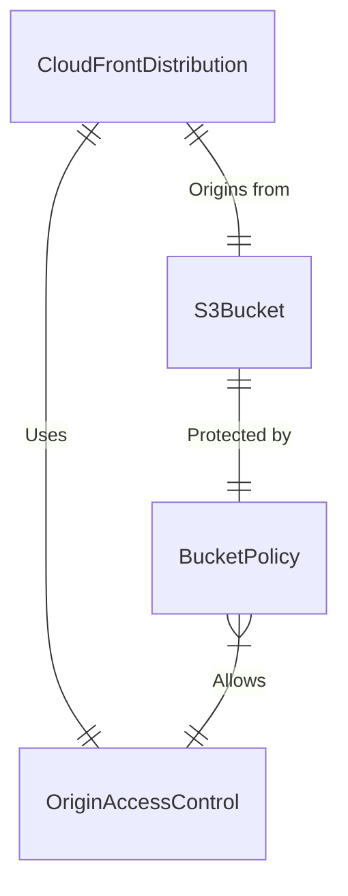

# Infrastructure Data Model: Deploy SPA to S3

**Feature**: 006-deploy-spa-s3

## Terraform Resources

### Module: `frontend`

| Resource | Type | Description |
| :--- | :--- | :--- |
| `website_bucket` | `aws_s3_bucket` | Stores static assets (HTML, CSS, JS). |
| `bucket_oac` | `aws_cloudfront_origin_access_control` | Secures S3 access to CloudFront only. |
| `distribution` | `aws_cloudfront_distribution` | CDN for global delivery and HTTPS. |
| `bucket_policy` | `aws_s3_bucket_policy` | Allows `s3:GetObject` only from the CloudFront OAC. |

## Relationships

## Configuration Data (Variables)

| Variable | Type | Description |
| :--- | :--- | :--- |
| `environment` | string | Deployment environment (dev, staging, prod). |
| `project_name` | string | Prefix for resource naming. |
| `common_tags` | map(string) | Tags for cost allocation and management. |
